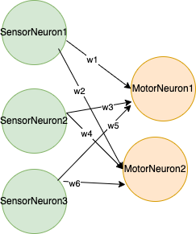

# Random 3D creature morphologies

Following is a submission for assignment 7 of Artificial life [course](https://www.mccormick.northwestern.edu/mechanical/academics/courses/descriptions/495-artificial-life.html). 


# flow diagram of 3D morphologies created


# Demo

Youtube video [link](https://youtu.be/q94R_4tGaww)


# Installation

Follow instruction given [here](https://www.reddit.com/r/ludobots/wiki/installation/)

# Running the code

After installing pyrosim and pybullet, clone the repository and change into the directory.
Now run ```python3 generate_random_3d_morphologies.py``` . It'll generate 5 random 3D morphologies. You can re run this command for more random morphologies.


# Task

Task here is to generate random 3D morphologies. The links are randomly assigned a sensor. Green links have sensor while blue links don't have sensor.

# world 

World contains only two things (the horizontal plane) and spherical ball

# Creature

Creature has a 3D morphology with number of links ranging between [3,5] and number of joints ranging between [2,4] joints (revolute) with axis of rotation randomly assigned along x, y or z direction. 

# Brain

Brain contains random number of sensor nueorons and ranodm number of motor neurons each connected to a joint. each of this motor neuron is connected to all of the sensor neurons. There are no hidden neurons. 

## flow diagram of brain for 3 sensor nueuron and 2 motor neuron



# References

The codebase is developed as part of [ludobots course](https://www.reddit.com/r/ludobots/).

Simulation is built using Pyrosim [git](https://github.com/jbongard/pyrosim).