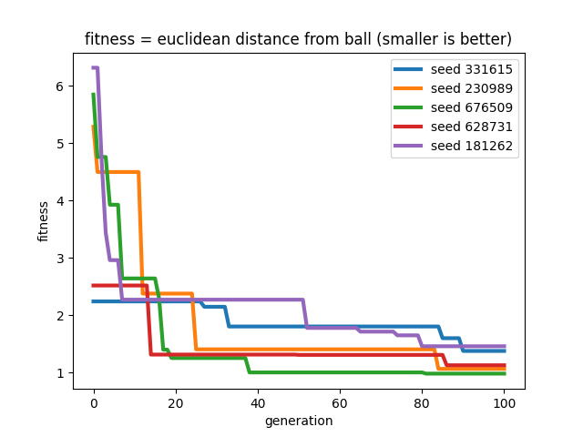
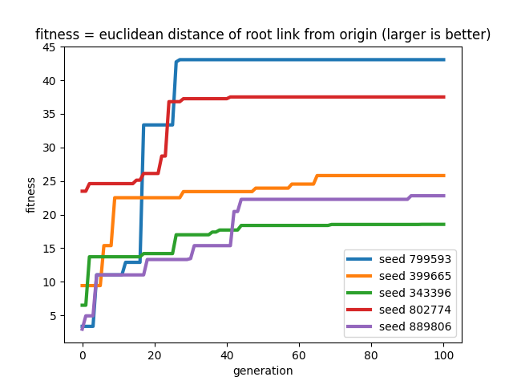

# Does body matters or brain is all we need?

Following is a submission for final project of Artificial life [course](https://www.mccormick.northwestern.edu/mechanical/academics/courses/descriptions/495-artificial-life.html) taught by [Dr. Sam Kriegman](https://www.mccormick.northwestern.edu/research-faculty/directory/profiles/kriegman-sam.html) at Northwestern University. 

# Teaser Gif


# Summary 2 minute video

[Youtube video](https://youtu.be/m7cQinZQo4g)

# B-Roll (extra footage of bloopers or interesting creatures)

<insert B - roll youtube video link>

# Motivation

In nature it's often seen that creatures coevolve body and brain during evolution. To understand whether coevolution acutally helps i have conducted following experiments. Motivation behind this project is to understand whether coevolving brain and body actually helps. To understand that hypothesis testing is done.

# Hypothesis

## Null hypothesis

```
For running task only evolving brain is enough i.e there is no need to coevolve brain and body
```

## Alternative hypothesis

```
For running task coevolving brain and body is helpful
```

## Hypothesis testing methodology

For testing the hypothesis an experiment setup is designed. I ran parallel hill climber of population size = 10 for 500 generations 5 times (with random seed each time). This eexperimental setup is run under two condtions. In both of these conditions all parameters are same except body is not evolved in setting 1. While in setting 2 both body and brain are evolved:

1. In first setting Only brain is evolved. This is achieved by setting Body mutation probability to zero and brain mutation probability to 1
2. Second setting has every other parameter same except that both brain and body can evolve here. This is achieved by setting body mutation probability to non zero values and brain muatation probability to also nonzero.

Note: In second setting body mutation probability and brain mutation probability are initialized such that in starting the body mutation is more probable. In starting Body mutation probability is 1 and brain mutation probability is zero. However as the evolution continues the probability of brain mutation increases to maximum of 0.7 and probability body mutation decreases gradually to minimum of 0.3


<insert diagram of how best creatures are created and compared>

# Overview of the environment and creature
# World 

World is ver simple and non dynamic. The world remains same for each generation of evolution. The world is also kept same under both of the experimentation conditions. World contains only two things (the horizontal plane) and a spherical ball. 

# Creature
## Body

The creature is made of cubes (links). The size of these links is completely arbitrary and decided by evolution. These links are connected by revolute joint. Any two adjacent links have the revolute joint between them. This revolute joint is later connected to a motor neuron which makes the links move rotate around the joint. 

<insert phoenotype and genotype diagram>
<insert diagram of relative position>

## sensors

A link can have a touch sensor. A link is assigned a touch sensor with a probability of 0.5 for initial genotype creation. The touch sensor return a +1 value when in contact with the ground and -1 otherwise. The touch sensor helps the creature in assesing the environment. The touch sensor also helps the creature in having knowledge of it's current state.

<insert green and blue color link>

## Motors

A motor is attched at each of the joint with an axis of rotation depending on the direction which the child link is attached. Maximum motor strength is set to <enter>. 

<insert motor link diagram>

## Brain

Our brain has 3 big components
1. sensory neuron: retrievs touch sensor values from the corresponding link
2. motor neuron: responsible for controlling the moror of a joint
3. synapse: synapse connects a sensor neuron to motor neurons. These are weigh values ranging between [-1,1]

The core part of our brain are the synapse weights. These weights are updated whenever a brain mutation is performed. 

Overall brain of our creature is a fully connected neural network with only 2 layers. The input layer is of sensory neurons. This layer is connected to the motor neuron layer with synapse weights. The network takes touch sensor values as input. The output of the netowrk is fed to the motor neurons which inturn controls the movement of the creature.

## Creature locomotion
The creature has revolute joints between the links. The robot rotates the link via motor neurons. The link movement in turn moves the whole creature.
<insert diagram>

<brain connections>

# How Evolution works (Parallel Hill Climber)

<insert fitness>
<insert evolution flow>
<how selection works>
<lineage>
<mutation example and demonstration>

# results

# fitness plots

<insert average and best fitness plots>

# Discussion


# Conclusion

# Running the code

## Setup

## Run evolution

## see best creature

## see creature evolving

## Generate graphs

## Reproducibility
<added random seed for evolution in search.py>

# References


# flow diagram of how 3D morphologies are created


# Flow diagram of how body is mutated

## mutation 1 Add or remove sensor


## mutation 2 Add or remove a link


# Flow diagram of how brain is mutated


# Task

## Task 1
Task here is to evovle a 3D creature that can go towards a target location (ball in this task).
minimize fitness where fitness = euclidean_distance(robot, ball)
```fitness = np.sqrt((x_robot - x_ball)**2 + (y_robot - y_ball)**2 + (z_robot-z_ball)**2)```

### Fitness curve task 1



## Task 2
Task here is to reach as far as possible from the origin (i.e running fast) 

maximize fitness where fitness = euclidean_distance(robot, origin)
```fitness = np.sqrt(x_robot**2 + y_robot**2 + z_robot**2)```

### Fitness curve task 2


# Demo

Youtube video [link](https://www.youtube.com/watch?v=LvTa5BgFEJA)


# Installation

Follow instruction given [here](https://www.reddit.com/r/ludobots/wiki/installation/)

# Running the code

After installing pyrosim and pybullet, clone the repository and change into the directory.
Now run ```python3 search.py``` . It'll run parallel hill climber five times. In starting it'll show a random creature and then it'll show evolved creature for each run.


# world 

World contains only two things (the horizontal plane) and spherical ball

# Creature

Creature has a 3D morphology with number of links ranging between [3,5] and number of joints ranging between [2,4] joints (revolute) with axis of rotation randomly assigned along x, y or z direction. 

# Brain

Brain contains random number of sensor nueorons and ranodm number of motor neurons each connected to a joint. each of this motor neuron is connected to all of the sensor neurons. There are no hidden neurons. 

## flow diagram of brain for 3 sensor nueuron and 2 motor neuron


# References

The codebase is developed as part of [ludobots course](https://www.reddit.com/r/ludobots/).

Simulation is built using Pyrosim [git](https://github.com/jbongard/pyrosim).
