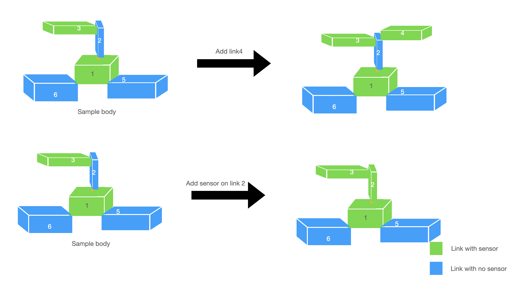
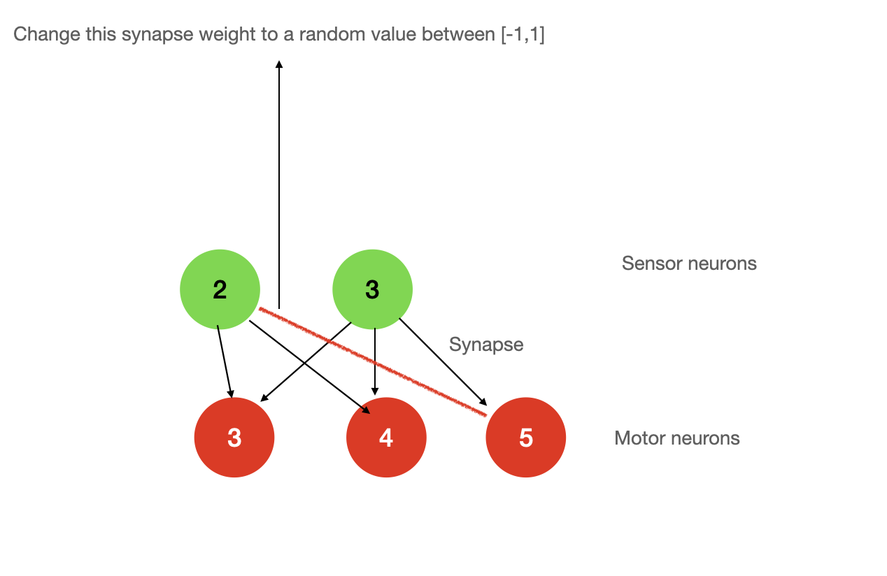
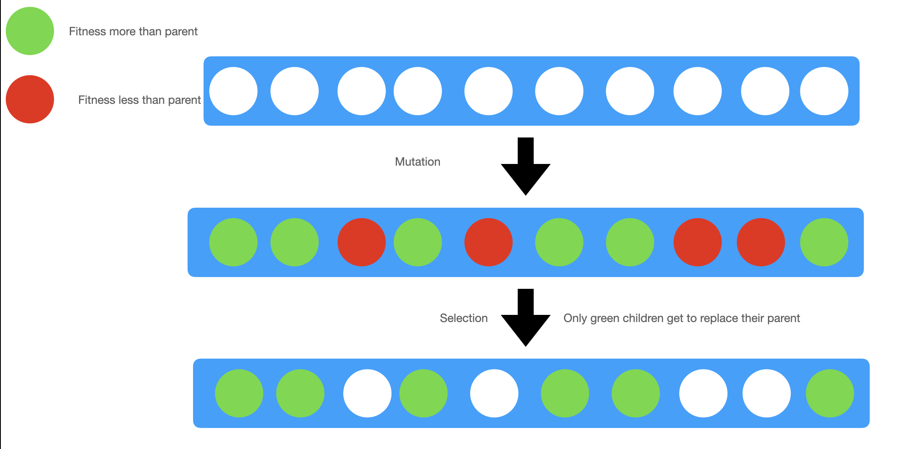

# Does body matters or brain is all we need?

Following is a submission for final project of Artificial life [course](https://www.mccormick.northwestern.edu/mechanical/academics/courses/descriptions/495-artificial-life.html) taught by [Dr. Sam Kriegman](https://www.mccormick.northwestern.edu/research-faculty/directory/profiles/kriegman-sam.html) at Northwestern University. 

# Teaser Gif


# Summary 2 minute video

[Youtube video](https://youtu.be/m7cQinZQo4g)

# B-Roll (extra footage of bloopers or interesting creatures)

<insert B - roll youtube video link>

# Motivation

In nature it's often seen that creatures coevolve body and brain during evolution. To understand whether coevolution acutally helps i have conducted following experiments. Motivation behind this project is to understand whether coevolving brain and body actually helps. To understand that hypothesis testing is done.

# Task for the creature

Task for the creature here is to reach as far as possible from the origin (i.e running fast) 

maximize fitness where fitness = euclidean_distance(robot, origin)
```fitness = np.sqrt(x_robot**2 + y_robot**2 + z_robot**2)```


# Hypothesis

## Null hypothesis

```
For running task only evolving brain is enough i.e there is no need to coevolve brain and body
```

## Alternative hypothesis

```
For running task coevolving brain and body is helpful
```

## Hypothesis testing methodology

For testing the hypothesis an experiment setup is designed. I ran parallel hill climber of population size = 10 for 500 generations 5 times (with random seed each time). This eexperimental setup is run under two condtions. In both of these conditions all parameters are same except body is not evolved in setting 1. While in setting 2 both body and brain are evolved:

1. In first setting Only brain is evolved. This is achieved by setting Body mutation probability to zero and brain mutation probability to 1
2. Second setting has every other parameter same except that both brain and body can evolve here. This is achieved by setting body mutation probability to non zero values and brain muatation probability to also nonzero.

Note: In second setting body mutation probability and brain mutation probability are initialized such that in starting the body mutation is more probable. In starting Body mutation probability is 1 and brain mutation probability is zero. However as the evolution continues the probability of brain mutation increases to maximum of 0.7 and probability body mutation decreases gradually to minimum of 0.3


# Overview of the environment and creature
# World 

World is ver simple and non dynamic. The world remains same for each generation of evolution. The world is also kept same under both of the experimentation conditions. World contains only two things (the horizontal plane) and a spherical ball. 

# Creature
## Body

The creature is made of cubes (links). The size of these links is completely arbitrary and decided by evolution. These links are connected by revolute joint. Any two adjacent links have the revolute joint between them. This revolute joint is later connected to a motor neuron which makes the links move rotate around the joint. 

It cab seen below how a rabdom 3D creature is created for initial genotype


<!-- ### flow diagram of how 3D morphologies are created
 -->
<!-- <insert phoenotype and genotype diagram>
<insert diagram of relative position> -->

## Genotype and phenotype representation
Here i've used direct encoding for genotype. Since we're randomly attaching links we can represent by asingle recursive arrow. This genotype encoding results in the phenotype on right.


## sensors

A link can have a touch sensor. A link is assigned a touch sensor with a probability of 0.5 for initial genotype creation. The touch sensor return a +1 value when in contact with the ground and -1 otherwise. The touch sensor helps the creature in assesing the environment. The touch sensor also helps the creature in having knowledge of it's current state.

<!-- <insert green and blue color link> -->
Following color convention is used to mark a link with/without sensor


## Motors

A motor is attched at each of the joint with an axis of rotation depending on the direction which the child link is attached. Maximum motor strength is set to <enter>. 

<!-- <insert motor link diagram> -->
Shown below is how a revolute joint is attached


## Brain

Our brain has 3 big components
1. sensory neuron: retrievs touch sensor values from the corresponding link
2. motor neuron: responsible for controlling the moror of a joint
3. synapse: synapse connects a sensor neuron to motor neurons. These are weigh values ranging between [-1,1]


The core part of our brain are the synapse weights. These weights are updated whenever a brain mutation is performed. 

Overall brain of our creature is a fully connected neural network with only 2 layers. The input layer is of sensory neurons. This layer is connected to the motor neuron layer with synapse weights. The network takes touch sensor values as input. The output of the netowrk is fed to the motor neurons which inturn controls the movement of the creature.


### sample brain of 2 sensor nueuron and 3 motor neurons


## Creature locomotion
The creature has revolute joints between the links. The robot rotates the link via motor neurons. The link movement in turn moves the whole creature.

# How Evolution works (Parallel Hill Climber)

Parallel hill climbing (PHC) is used for evolving the creatures gradually. Parallel hill climbing is similar to [hill climbing](https://en.wikipedia.org/wiki/Hill_climbing). The difference here is that there are multiple parents (population size >1). 


PHC has following steps:
1. Evaluate
	During this step each of the creature is simulated and the fitness score is calculated. The fitness score is assigned to the respective creature. The fitness score denotes how good the creature is for the task in hand.

2. Spawn
	During this step copies of the parent are created. These copies are also known as children.

3. Mutate
	During this step, small and random changes are made in the children. **This step differs for the two experimental setup we have**. In one step only brain is mutated, while in the other both brain and body are mutated.
	## Flow diagram of how body is mutated

	### mutation 1 Add or remove sensor
	

	### mutation 2 Add or remove a link
	

	## Flow diagram of how brain is mutated
	

	Illustrations of these mutations are as follows

	
	
	

4. Select
	In this step, each of the mutated children are compared with their respective parent. If the children's fitness is better than the parent then the parent is replaced with the child (i.e child becomes parent for next generation).
	Note: The children are only compared to their repspective parent, this way the evolution of one family does not get affected by other family. This might become an issue sometimes.
	It is illustrated below
	


# results

# fitness plots

## best fitness plots


## average fitness plots


# Conclusion

We can clearly see from the best and average fitness plots that coevolving brain and body has a significantly better performance compare to evolving just brain. Hence by proof of evidence, we reject the null hypothesis. So alternate hypothesis "For running task coevolving brain and body is helpful" is proved.


<!-- # Discussion -->

# Running the code

## Setup
Follow instruction given [here](https://www.reddit.com/r/ludobots/wiki/installation/)

## For running evolution

run ```python3 search.py```


## see best creature
uncomment top part of view.py and run ```python3 view.py```

## see creature evolving

run ```python3 view.py 6```

## Generate graphs
run ```python3 analyze.py```

## Reproducibility
for reproducibility random seed is fixed in the search.py file. To see already evolved creatures run ```python3 view.py 6```

# References
Artificial life [course](https://www.mccormick.northwestern.edu/mechanical/academics/courses/descriptions/495-artificial-life.html) taught by [Dr. Sam Kriegman](https://www.mccormick.northwestern.edu/research-faculty/directory/profiles/kriegman-sam.html) at Northwestern University.

The codebase is developed as part of [ludobots course](https://www.reddit.com/r/ludobots/) taught by .

Simulation is built on top of Pyrosim [git](https://github.com/jbongard/pyrosim).


